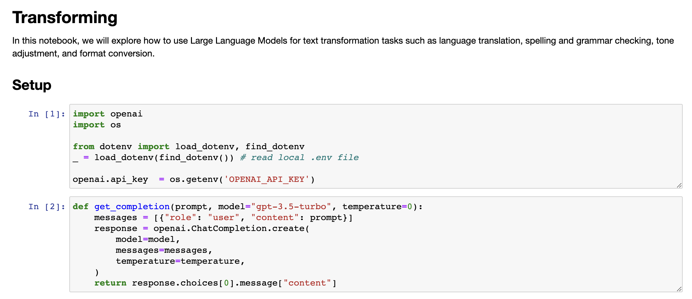
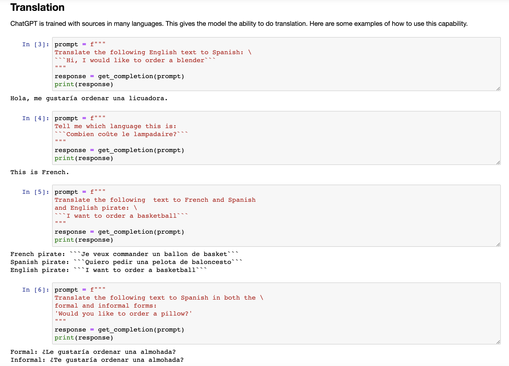
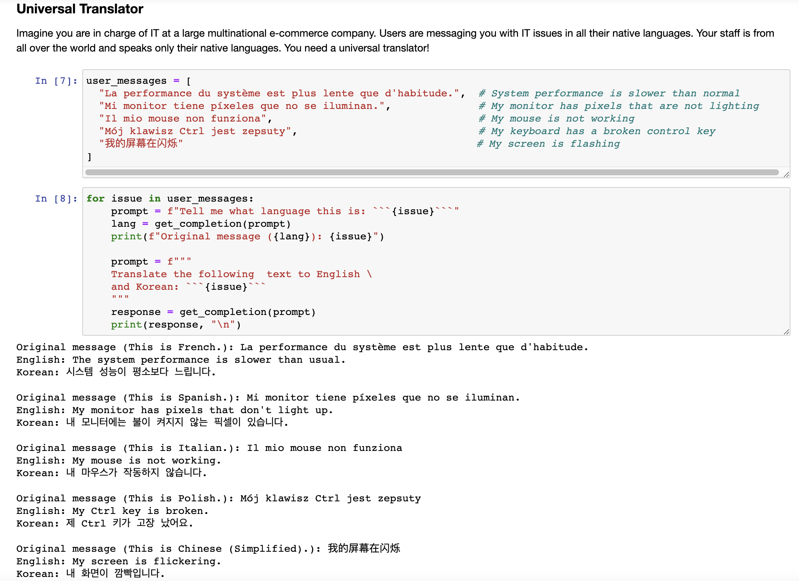
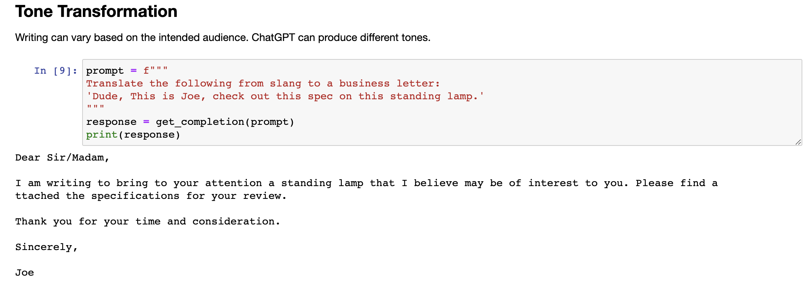
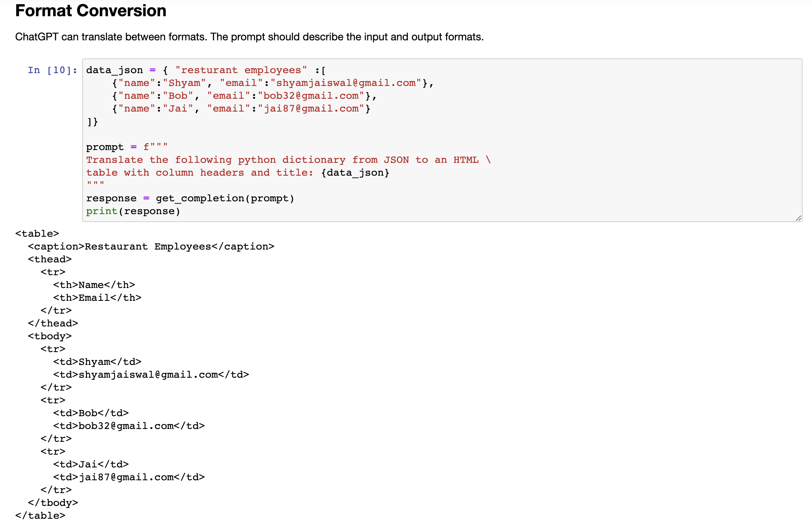
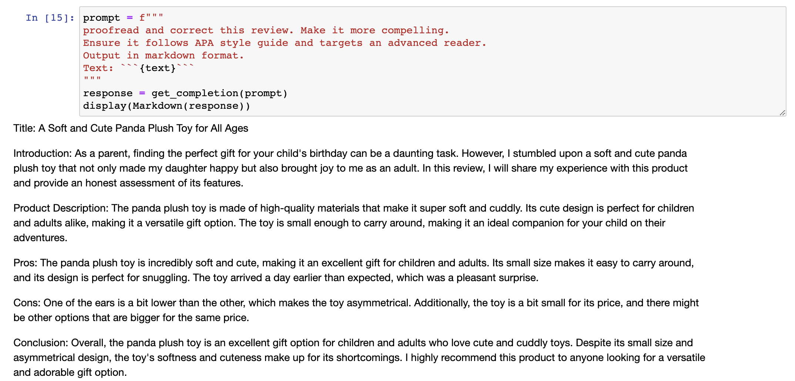

# 6.转换类应用

---

```{toctree}
:maxdepth: 2
:caption: 目录
```

```
chatgpt prompt：请帮我用中文进行全文翻译下面这段英文，并结构化输出为中文文本段落
```

```
Large language models are very good at transforming its input to a different format, such as inputting a piece of text in one language and transforming it or translating it to a different language, or helping with spelling and grammar corrections, so taking as input a piece of text that may not be fully grammatical and helping you to fix that up a bit, or even transforming formats such as inputting HTML and outputting JSON. So there's a bunch of applications that I used to write somewhat painfully with a bunch of regular expressions that would definitely be much more simply implemented now with a large language model and a few prompts. 
```

大型语言模型非常擅长将其输入转换为不同的格式，例如将一种语言中的文本输入并将其转换或翻译成另一种语言，或帮助拼写和语法矫正，因此，您可以输入一段可能不完全符合语法规范的文本，并帮助你稍微修改一下，或者甚至转换格式，例如输入HTML并输出JSON。因此，我以前用一堆正则表达式写的一堆应用程序现在肯定可以更简单地实现，只需要使用一个大型语言模型和几个提示即可。大型语言模型可以使这些转换过程更加简单和高效，为人们提供更好的文本相关应用体验。

```
Yeah, I use Chat GPT to proofread pretty much everything I write these days, so I'm excited to show you some more examples in the notebook now. So first we'll import OpenAI and also use the same getCompletion helper function that we've been using throughout the videos. 
```

是的，我现在基本上会使用 Chat GPT 来校对我所写的每一篇文章，所以现在我很高兴向您展示更多 Notebook 中的例子。所以首先我们将导入 OpenAI 并使用相同的 getCompletion 帮助函数，这是我们在视频中一直在使用的。



## 6.1 翻译任务

```
And the first thing we'll do is a translation task. So large language models are trained on a lot of text from kind of many sources, a lot of which is the internet, and this is kind of, of course, in many different languages. So this kind of imbues the model with the ability to do translation. And these models know kind of hundreds of languages to varying degrees of proficiency. And so we'll go through some examples of how to use this capability. 
```

接下来我们将执行一个翻译任务。因此，大型语言模型是在很多来源的文本上进行训练的，其中很多是互联网的内容，并且这些文本内容是以许多不同的语言呈现的。这种训练使模型具有进行翻译的能力。这些模型能够以不同程度掌握数百种语言，因此我们将讨论如何使用这种能力的一些示例。

```
So let's start off with something simple. So in this first example, the prompt is translate the following English text to Spanish. Hi, I would like to order a blender. And the response is Hola, me gustaría ordenar una licuadora. And I'm very sorry to all of you Spanish speakers. I never learned Spanish, unfortunately, as you can definitely tell. OK, let's try another example. So in this example, the prompt is, tell me what language this is. And then this is in French, Combien coûte la lampe d'air. And so let's run this. And the model has identified that this is French. 
```

让我们从一些简单的例子开始。在第一个例子中，提示是将以下英文文本翻译成西班牙语。 Hi，我想订购一个搅拌机。回复是Hola，me gustaría ordenar una licuadora。非常抱歉，对于所有的西班牙语使用者，我从未学过西班牙语，您肯定已经注意到了。好的，让我们再试一个例子。在此例中，提示是告诉我这是什么语言。然后，这是法语，Combien coûte la lampe d'air。让我们运行一下。模型已经确定这是法语。



```
The model can also do multiple translations at once. So in this example, let's say, translate the following text to French and Spanish. And you know what, let's add another an English pirate. And the text is, I want to order a basketball. So here we have French, Spanish, and English pirates. 
```

## 6.2 通用翻译器

模型还可以同时进行多个翻译。在这个例子中，让我们假设，将以下文本翻译成法语和西班牙语。您知道吗，让我们再加上一个英语语。文本是，我想订购一个篮球。因此，我们拥有法语、西班牙语和英语语。



```
So in some languages, the translation can change depending on the speaker's relationship to the listener. And you can also explain this to the language model. And so it will be able to kind of translate accordingly. So in this example, we say, translate the following text to Spanish in both the formal and informal forms. Would you like to order a pillow? And also notice here, we're using a different delimiter than these backticks. It doesn't really matter as long as it's kind of a clear separation. So, here we have the formal and informal. So, formal is when you're speaking to someone who's kind of maybe senior to you or you're in a professional situation. That's when you use a formal tone and then informal is when you're speaking to maybe a group of friends. I don't actually speak Spanish but my dad does and he says that this is correct. 
```

因此，在某些语言中，翻译可能会根据说话者与听众的关系而发生变化。您可以向语言模型解释这一点，因此它将能够相应地进行翻译。所以在这个例子中，我们说，将以下文本翻译成西班牙语，适用于正式和非正式形式。Would you like to order a pillow？在这里请注意，我们使用不同的定界符，而不是这些反引号。只要它们是清晰的分隔符，实际上并不重要。所以，我们有正式和非正式形式。正式形式是当您与地位可能高于您的人交谈或处于专业情境时使用的语气，而非正式形式是当您与朋友交谈时使用的语气。我实际上不会讲西班牙语，但是我爸爸会，他说这是正确的。

## 6.3 语调转换

```
So, for the next example, we're going to pretend that we're in charge of a multinational e-commerce company and so the user messages are going to be in all different languages and so users are going to be telling us about their IT issues in a wide variety of languages. So, we need a universal translator. So, first we'll just paste in a list of user messages in a variety of different languages and now we will loop through each of these user messages. So, for issue in user messages and then I'm going to copy over this slightly longer code block. And so, the first thing we'll do is ask the model to tell us what language the issue is in. So, here's the prompt. Then we'll print out the original message's language and the issue and then we'll ask the model to translate it into English and Korean. So, let's run this. So, the original message in French. 
```

因此，接下来的例子中，我们将假设自己是一家跨国电子商务公司的负责人，用户留言将会是各种不同的语言，因此用户将用各种不同的语言告诉我们其 IT 问题。所以，我们需要一个通用翻译器。首先，我们将粘贴一份使用各种不同语言的用户留言列表，现在我们将循环遍历这些用户留言。对于留言集中的问题，我要复制一下稍长的代码块。因此，我们首先将询问模型告诉我们留言所使用的是哪种语言，然后我们将打印出原始留言的语言和问题，并要求模型将其翻译成英文和韩文。接下来，运行这个程序，原始留言是用法语写的。



```
So, we have a variety of languages and then the model translates them into English and then Korean and you can kind of see here, so the model says this is French. So, that's because the response from this prompt is going to be this is French. You could try editing this prompt to say something like tell me what language this is, respond with only one word or don't use a sentence, that kind of thing, if you wanted this to just be kind of one word. Or you could kind of ask for it in a JSON format or something like that, which would probably encourage it to not use a whole sentence. 
```

因此，我们有各种各样的语言，然后模型将它们翻译成英文和韩文，你可以在这里看到，所以模型说这是法语。因为这个提示的回应将是这是法语。你可以尝试编辑这个提示，改成类似“告诉我这是哪种语言，只回答一个单词或不要使用一个句子”这样的话，如果你只想要一个单词的反馈。或者你可以请求以JSON格式返回，这可能会鼓励它不使用整个句子。

```
And so, amazing, you've just built a universal translator. And also feel free to pause the video and add kind of any other languages you want to try here, maybe languages you speak yourself and see how the model does. So the next thing we're going to dive into is tone transformation. Writing can vary based on kind of an intended audience, you know, the way that I would write an email to a colleague or a professor is obviously going to be quite different to the way I text my younger brother. And so ChatGBT can actually also help produce different tones.
```

太神奇了，你刚刚建立了一个通用翻译器。此外，随意暂停视频，并添加任何其他你想要尝试的语言，也许是你自己熟悉的语言，看看模型的表现如何。接下来，我们要涉及的是情感转换。写作可以因受众的不同而变化，你知道，我写给同事或教授的电子邮件显然与我给年轻弟弟发送文本的方式大不相同。因此，ChatGBT实际上还可以帮助产生不同的语调。

## 6.4 格式转换

```
So let's look at some examples. So in this first example, the prompt is, translate the following from slang to a business letter. Dude, this is Joe, check out this spec on the standing lamp. So, let's execute this. And as you can see, we have a much more formal business letter with a proposal for a standing lamp specification. The next thing that we're going to do is to convert between different formats. ChatGBT is very good at translating between different formats such as JSON to HTML, you know, XML, all kinds of things. Markdown. And so in the prompt, we'll describe both the input and the output formats. So here is an example. So we have this JSON that contains a list of restaurant employees with their names and email. And then in the prompt, we're going to ask the model to translate this from JSON to HTML.
```

那么，让我们看一些例子。在第一个例子中，提示是将以下俚语翻译成商务书信。兄弟，这是乔，看看这盏落地灯的规格。那么，让我们执行它。正如你所看到的，我们有了一封更为正式的商业信函，附有一份关于落地灯规格的提议。接下来，我们要做的事情是在不同的格式之间进行转换。ChatGBT非常擅长在不同的格式之间进行翻译，例如JSON到HTML，XML等各种格式。Markdown。因此，在提示中，我们将描述输入和输出格式。这是一个例子。我们有一个包含餐厅员工姓名和电子邮件的JSON列表。然后在提示中，我们要求模型将它从JSON转换为HTML。



```
So the prompt is, translate the following Python dictionary from JSON to an HTML table with column headers and titles. And then we'll get the response from the model and print it. So here we have some HTML displaying all of the employee names and emails. And so now let's see if we can actually view this HTML. So we're going to use this display function from this Python library. Display HTML response. And here you can see that this is a properly formatted HTML table. The next transformation task we're going to do is spell check and grammar checking. 
```

因此，提示是将以下Python字典从JSON转换为带有列标题和标题的HTML表格。然后，我们将获取模型的响应并将其打印出来。这里有一些HTML，显示所有员工的姓名和电子邮件。接下来让我们看看是否能够查看这个HTML。我们将使用Python库中的这个disaplay函数。显示HTML响应。在这里，你可以看到这是一个格式正确的HTML表格。我们接下来要进行的转换任务是拼写检查和语法检查。


```
And this is a really kind of popular use for chatGPT. I highly recommend doing this. I do this all the time. And it's especially useful when you're working in a non-native language. 
```

这是chatGPT的一个很流行的用途。我强烈推荐这样做。我总是这样做。当你在非母语语言中工作时，这尤其有用。

## 6.5 语法拼写检查

```
And so here are some examples of some kind of common grammar and spelling problems and how the language model can help address these. So I'm going to paste in a list of sentences that have some kind of grammatical or spelling errors. And then we're going to loop through each of these sentences. And ask the model to proofread these. Proofread and correct. And then we'll use some delimiters. And then we will get the response and print it as usual. And so the model is able to correct all of these grammatical errors. 
```


下面是一些普遍的语法和拼写问题的例子以及语言模型如何帮助解决这些问题。我们将复制一些具有语法或拼写错误的句子列表，然后逐一循环这些句子。请模型校对和纠正这些错误。然后我们将使用一些分隔符。我们将得到响应并像往常一样进行打印。因此，该模型能够纠正所有这些语法错误。


```
We could use some of the techniques that we've discussed before. So to improve the prompt, we could say proofread and correct the following text. And rewrite the whole... And rewrite it. Corrected version. If you don't find any errors, just say no errors found. Let's try this. So this way we were able to... Oh, they're still using quotes here. But you can imagine you'd be able to find a way with a little bit of iterative prompt development to kind of find a prompt that works more reliably every single time. And so now we'll do another example. 
```

我们可以使用之前讨论过的一些技术。为了改进提示，我们可以说“校对和纠正以下文本。重写它。纠正后的版本。如果你没有找到任何错误，只需说没有发现错误。让我们试试这个。”这样我们能够......哦，他们仍然在这里使用引号。但是你可以想象通过一点迭代的提示开发，你可以找到一个更可靠的提示，每次都能正常工作。现在我们将做另一个例子。


```
It's always useful to check your text before you post it in a public forum. And so we'll go through an example of checking a review. And so here is a review about a stuffed panda. And so we're going to ask the model to proofread and correct the review. Great. So we have this corrected version. And one cool thing we can do is find the kind of differences between our original review and the model's output. So we're going to use this RedLines Python package to do this. And we're going to get the diff between the original text of our review and the model output and then display this. And so here you can see the diff between the original review and the model output and the kind of things that have been corrected. 
```

在发布到公共论坛之前检查文本始终是有用的。所以我们将通过一个检查评论的例子来说明。这是关于一只填充pandas的评论。我们要求模型检查和校正评论。很好。我们有了这个更正的版本。我们可以做的很酷的一件事是找到原始评论和模型输出之间的差异。所以我们将使用RedLines Python包来做这件事。我们将得到我们评论的原始文本和模型输出之间的差异，然后显示它。因此，在这里，您可以看到原始评论和模型输出之间的差异以及已经被更正的内容。


```
So the prompt that we used was, uhm, proofread and correct this review, but you can also make kind of more dramatic changes, uhm, kind of changes to tone and that kind of thing. So, let's try one more thing. So in this prompt, we're going to ask the model to proofread and correct this same review, but also make it more compelling and ensure that it follows APA style and targets an advanced reader. And we're also going to ask for the output in markdown format. 
```

所以我们使用的提示是：“校对和纠正此评论”，但是您也可以进行更为重大的更改，例如对语调进行更改等。让我们再尝试一件事。在这个提示中，我们将要求模型校对和纠正相同的评论，但同时让它更具吸引力，并确保遵循APA样式，针对高级读者。我们还将要求以markdown格式输出。

```
And so we're using the same text from the original review up here. So let's execute this. And here we have a expanded APA style review of the SoftPanda. So this is it for the transforming video. Next up we have expanding where we'll take a shorter prompt and kind of generate a longer, more freeform response from a language model. 
```

因此，我们在此处使用的是来自原始评论的相同文本。让我们执行它。在这里，我们有一个扩展的APA样式评论SoftPanda。这是关于转换视频的全部内容。接下来，我们将展开，在此我们将使用较短的提示，并从语言模型中生成更长、更自由的响应。


